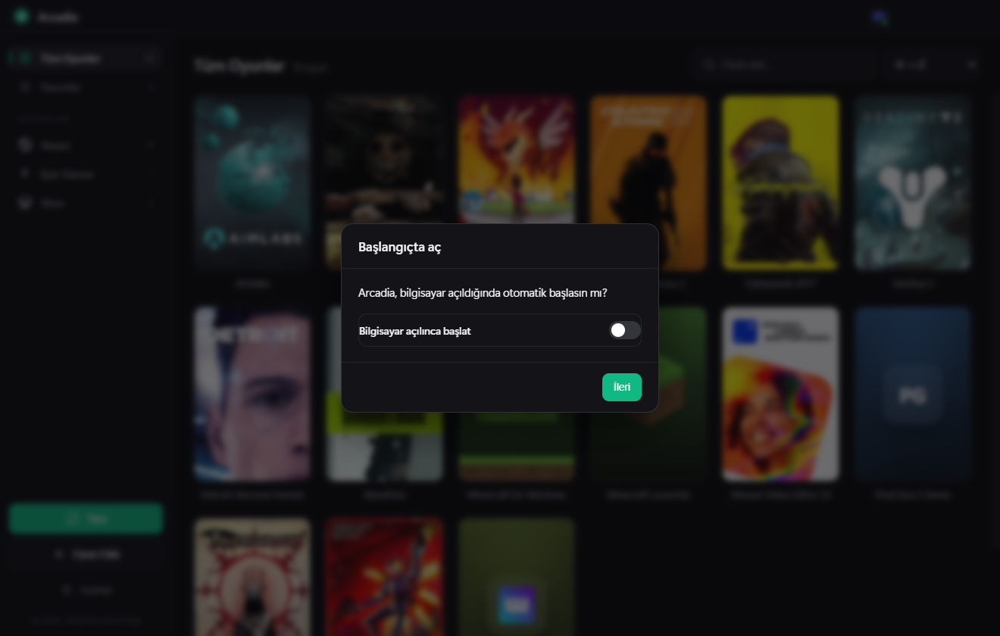

<div align="center">


# Arcadia

**All your games in one beautiful library.**

Arcadia automatically finds your Steam, Epic Games, Xbox / Game Pass and desktop games, shows them with real cover art, and launches any of them with a single click.


</div>

---

## ✨ Features

- 🔍 **Automatic scanning** — finds Steam, Epic Games, Xbox / Game Pass and desktop-shortcut games on its own, and re-scans silently on every launch (added games appear, uninstalled ones disappear, your data is kept).
- 🖼️ **Real cover art** — Steam games come with store covers; for the rest you can add your own free **SteamGridDB** key to fetch real covers. Minecraft ships with hand-drawn cover tiles, and anything without a cover gets a clean branded tile.
- ▶️ **One-click launch** — click a card and the game starts (Steam protocol, `.exe`, or shortcut).
- 🟢 **Running indicator & force-close** — a running game is marked live; click the red **×** to close it instantly (and its companion apps with it).
- 🤝 **Companion apps** — link apps (Discord, FACEIT, overlays…) to a game so they open together.
- 🗔 **System tray** — keeps running in the background when closed; right-click the tray icon for your most-played games. Optional launch-at-startup.
- 🎨 **Logo customization** — change the accent color and the logo (color / shape / symbol); the Windows taskbar icon updates live.
- ⭐ **Favorites, search & sorting** — A→Z, recently added, recently played.
- 🌍 **Multilingual** — 6 languages, auto-detected from your PC.
- 🌙 **Minimalist dark UI** — cover grid, smooth hover effects, frameless window.

## 🌐 Language support

Arcadia ships in **6 languages** and picks one automatically from your Windows locale (you can change it any time in **Settings → Language**):

| Language | | Language | |
|---|---|---|---|
| 🇹🇷 Türkçe | Turkish | 🇯🇵 日本語 | Japanese |
| 🇬🇧 English | English | 🇰🇷 한국어 | Korean |
| 🇩🇪 Deutsch | German | 🇪🇸 Español | Spanish |

Auto-detect: Turkish/Azerbaijani → Turkish, German → German, Japanese → Japanese, Korean → Korean, Spanish → Spanish, everything else → English.

## 📸 Screenshot

<div align="center">

</div>

## ⬇️ Download & Install

1. Download **`Arcadia-Setup-1.0.2.exe`** from the [Releases](../../releases) page.
2. Run it (see the SmartScreen note below).
3. Follow the installer — Arcadia adds Start-menu and desktop shortcuts and opens automatically, then scans your games.

> Uninstalling keeps your library and settings (they live in `%APPDATA%\Arcadia`).

### ⚠️ "Windows protected your PC" (SmartScreen)?

This warning is **normal and expected** — it does **not** mean anything is wrong with Arcadia. To continue:

> **More info → Run anyway**

**Why it appears:** Windows SmartScreen warns about *any* installer that isn't signed with a **paid** code-signing certificate from a Certificate Authority. Code signing is **unrelated to whether a project is open source** — many trustworthy open-source apps show the exact same warning until their author buys a certificate.

Because Arcadia is fully open source, you don't have to take the prebuilt installer on trust — you can **read every line of the code and [build it yourself](#-build-from-source)**; the result is identical. Signed, warning-free releases will follow if the project gets a code-signing certificate.

## 🖼️ Cover art (optional SteamGridDB key)

Steam games already have covers. To fetch real covers for non-Steam games (Valorant, League of Legends, etc.), add your own **free** SteamGridDB key:

**Settings → Cover Art (SteamGridDB)** → paste your key.

Get a free key at [steamgriddb.com](https://www.steamgriddb.com) → *Preferences → API*. The key is stored locally on your machine only and is never shared.

## 🚀 Build from source

Requirements: [Node.js](https://nodejs.org) 18+

```bash
# Install dependencies
npm install

# Run the app
npm start

# Build the Windows installer (output in dist/)
npm run dist
```

## 🧩 How it works

| Source | How it's found | How it launches |
|--------|----------------|-----------------|
| **Steam** | reads `libraryfolders.vdf` + `appmanifest_*.acf` | `steam://rungameid/<appid>` |
| **Epic** | `ProgramData\Epic\...\Manifests\*.item` | `com.epicgames.launcher://` deep-link |
| **Xbox** | main `.exe` under `XboxGames\<Game>\Content\` | direct `.exe` |
| **Shortcuts** | desktop `.lnk` / `.exe` (game clients & launchers) | the shortcut |
| **Folders** | `.exe` files in folders you add | direct `.exe` |
| **Manual** | a `.exe` / `.lnk` / `.url` you pick via "Add game" | opens the file |

Library and settings are stored in `%APPDATA%\Arcadia\library.json`.

## 🗂️ Project structure

```
arcadia/
├── main.js              # Electron main process + IPC, tray, icon
├── preload.js           # Secure renderer bridge
├── src/
│   ├── library.js       # Library & settings store
│   ├── launcher.js      # Game launching
│   ├── vdf.js           # Steam VDF/ACF parser
│   ├── sgdb.js          # Optional SteamGridDB cover lookup
│   └── scanners/        # steam, epic, xbox, folders, shortcuts
├── renderer/            # UI (HTML / CSS / JS)
├── assets/              # Logo, icons, screenshot
└── build/make_icon.py   # Generates the app icon from the logo
```

## 🛠️ Regenerating the icon

The logo lives in `assets/logo.svg`. To regenerate the PNG/ICO versions (Python + Pillow):

```bash
npm run icon   # or: py build/make_icon.py
```

## 📄 License

[MIT](LICENSE) © 2026 Samet Ege
