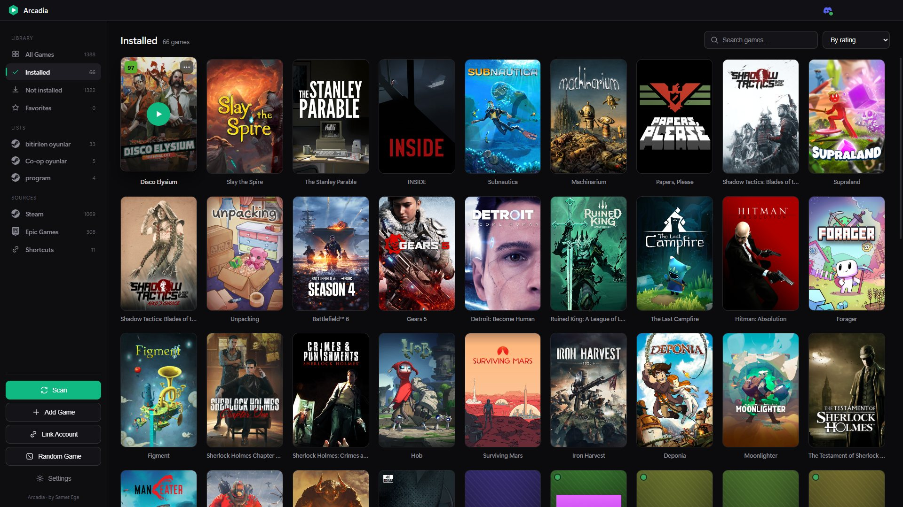
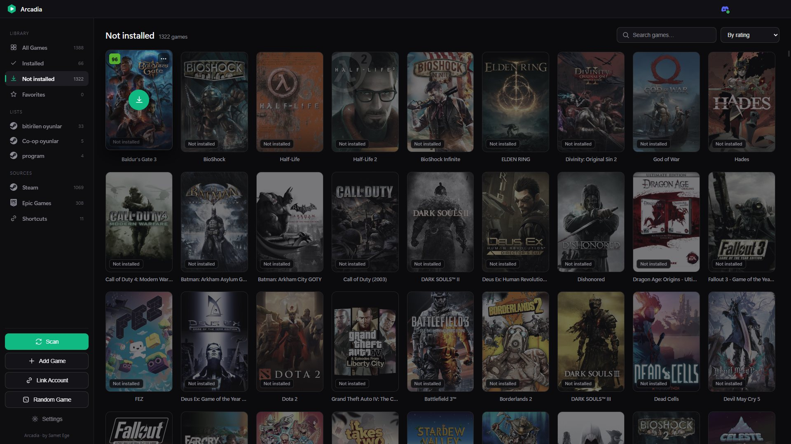
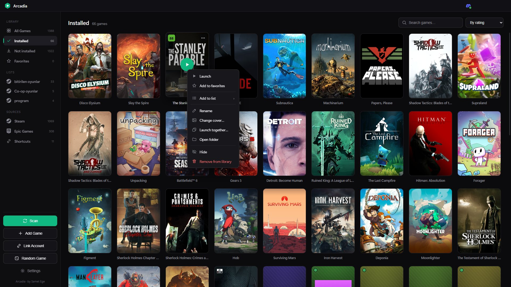
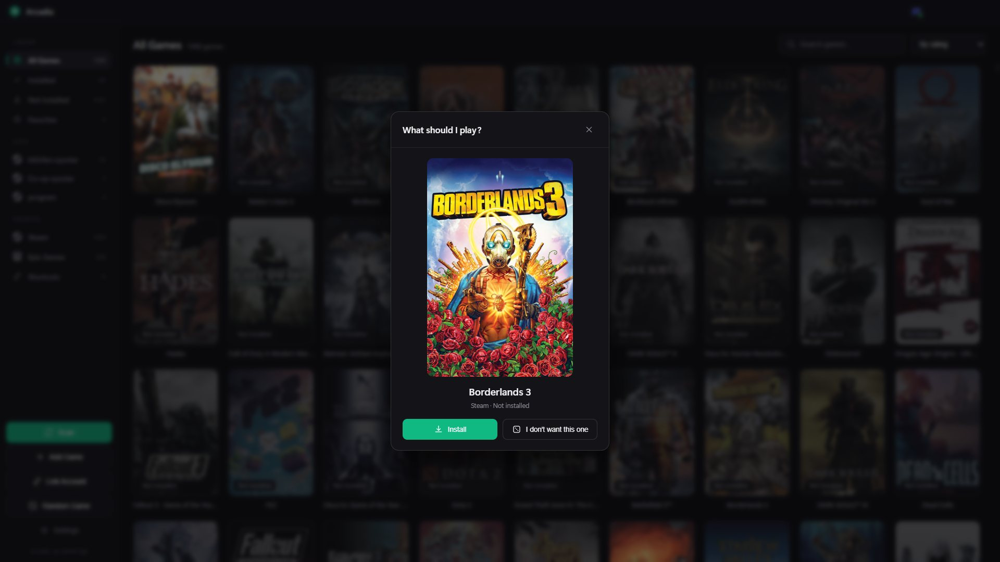
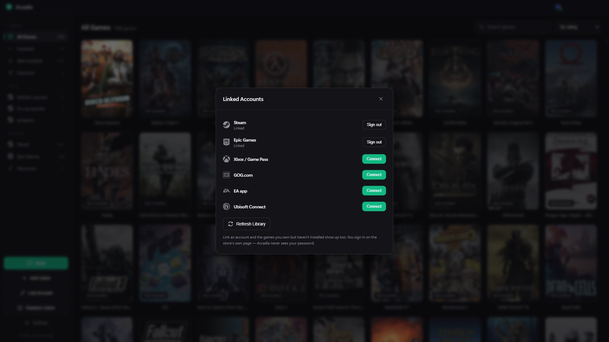

<div align="center">


# Arcadia

**All your games in one beautiful library.**

Arcadia finds the games on your PC and the ones you own on Steam, Epic Games, Xbox, GOG, EA and Ubisoft Connect,<br>
shows them with real cover art, and launches — or installs — any of them with a single click.

[](https://github.com/SametEge/Arcadia/releases/latest)
[](https://github.com/SametEge/Arcadia/releases)
[](https://github.com/SametEge/Arcadia/actions/workflows/ci.yml)


[](LICENSE)

### [⬇ Download the latest release](https://github.com/SametEge/Arcadia/releases/latest)

**English** · [Türkçe](README.tr.md)



</div>

---

## Contents

- [Highlights](#-highlights)
- [Screenshots](#-screenshots)
- [Download & install](#-download--install)
- [Getting started](#-getting-started)
- [Using Arcadia](#-using-arcadia)
- [Supported stores](#-supported-stores)
- [Languages](#-languages)
- [Privacy & your data](#-privacy--your-data)
- [FAQ & troubleshooting](#-faq--troubleshooting)
- [Build from source](#-build-from-source)
- [How it works](#-how-it-works)
- [Project structure](#-project-structure)
- [Roadmap](#-roadmap)
- [Contributing](#-contributing)
- [License](#-license)

## ✨ Highlights

- **Every store in one library** — Steam, Epic Games, Xbox / Game Pass, GOG, EA app, Ubisoft Connect, Riot and your desktop shortcuts, found automatically with no setup.
- **Your whole collection, not just what's installed** — link your store accounts and the games you own but haven't installed appear too, ready to install.
- **Install from Arcadia** — the store's own client downloads the game while Arcadia's download panel shows the progress.
- **Real cover art and Metacritic scores** — the store's own artwork first, SteamGridDB for the rest, or any image you pick.
- **Lists that follow Steam** — your Steam collections come in as lists, and you can make your own lists across every store.
- **One game, one card** — a game that shows up in more than one store isn't shown twice.
- **Can't decide?** — the random picker chooses a game for you.
- **Private by design** — no server, no telemetry, no ads. You sign in on each store's own page; Arcadia never sees your password.
- **Six languages**, a minimalist dark design, a system tray and automatic updates.

## 📸 Screenshots

<table>
  <tr>
    <td width="50%"><br><sub><b>Not installed</b> — everything you own on your linked accounts, here sorted by Metacritic score, one click from installing.</sub></td>
    <td width="50%"><br><sub><b>Game menu</b> — favorites, lists, rename, change cover, launch together, open folder, hide.</sub></td>
  </tr>
  <tr>
    <td width="50%"><br><sub><b>What should I play?</b> — a random pick from your library, with a re-roll.</sub></td>
    <td width="50%"><br><sub><b>Linked accounts</b> — Steam, Epic Games, Xbox / Game Pass, GOG, EA app and Ubisoft Connect.</sub></td>
  </tr>
</table>

## 📥 Download & install

### Requirements

- **Windows 10** version 1809 or later, or **Windows 11** — 64-bit
- About **400 MB** of free disk space
- The store clients you use (Steam, Epic Games Launcher, EA app, GOG Galaxy, Ubisoft Connect, Microsoft Store). Arcadia starts and installs games *through* them, so a game's store still has to be installed to play it.

### Installer

1. Download the latest **`Arcadia-Setup-<version>.exe`** from [Releases](https://github.com/SametEge/Arcadia/releases/latest).
2. Run it. Windows may warn you first — see the two notes below.
3. Choose where to install. Arcadia installs for your Windows account only, so it doesn't need administrator rights. It adds Start-menu and desktop shortcuts, opens, and scans your games.

Releases built by the release workflow come with a `SHA256SUMS.txt`, so you can check the file you downloaded:

```powershell
Get-FileHash .\Arcadia-Setup-<version>.exe -Algorithm SHA256
```

<details>
<summary><b>⚠️ "Windows protected your PC" (SmartScreen)</b></summary>

<br>

This warning is **normal and expected** — it does **not** mean anything is wrong with Arcadia. To continue:

> **More info → Run anyway**

Windows SmartScreen warns about *any* installer that isn't signed with a **paid** code-signing certificate. Code signing has nothing to do with whether a project is open source; many trustworthy open-source apps show the same warning.

Arcadia is fully open source, so you don't have to take the installer on trust: read the code and [build it yourself](#-build-from-source). Releases are built straight from the tagged source, normally by [GitHub Actions](.github/workflows/release.yml).

</details>

<details>
<summary><b>🛡️ Smart App Control blocks the installer</b></summary>

<br>

On Windows 11 PCs where **Smart App Control** is on, apps that aren't signed are blocked outright — there is no "Run anyway" button. Your options:

- **Wait for the Microsoft Store version** (below). Microsoft signs Store apps, so Smart App Control lets them through.
- **Run Arcadia from source** with `npm start` ([Build from source](#-build-from-source)). That runs on Electron's own signed runtime, which Smart App Control allows.

Turning Smart App Control off can't be undone without reinstalling Windows, so don't turn it off just for Arcadia.

</details>

### Microsoft Store

Arcadia is on its way to the Microsoft Store as **Arcadia Launcher**. The Store version is signed by Microsoft, so it installs with no SmartScreen or Smart App Control warning, and the Store keeps it up to date. A link will appear here once it's live.

### Updates

The installed version checks GitHub for a new release every time it starts. With automatic updates on (**Settings → Updates**, on by default), a new version downloads in the background and installs the next time you quit Arcadia. Turn the switch off to be asked instead — **Restart and install** appears in **Settings → Updates** when a new version is ready.

The Microsoft Store version doesn't use this; the Store updates it.

### Uninstalling

Uninstall Arcadia from **Windows Settings → Apps**. Your library and settings stay in `%APPDATA%\Arcadia`, so reinstalling picks up where you left off. To start completely fresh, delete that folder after uninstalling.

## 🚀 Getting started

1. **First launch** — Arcadia scans your PC (it takes a few seconds), asks whether it should start with Windows, and shows a short tour of the main buttons.
2. **Link your stores** — click **Link Account** in the sidebar, choose a store and sign in on the store's own page. The games you own but haven't installed appear under **Not installed**.
3. **Play** — click a card. An installed game starts right away through its store. For a game that isn't installed, the store's client starts the install and the download panel (top right) follows it.
4. **Organise** — star your favorites, make lists, and turn on **Steam collections** to bring your Steam lists in.
5. **Can't decide?** — click **Random Game**. Don't like the pick? **I don't want this one** rolls again.

## 📖 Using Arcadia

### The library

The sidebar splits your games into three groups:

| Group | What's in it |
|---|---|
| **Library** | **All Games**, **Installed**, **Not installed** and **Favorites**. Installed and Not installed appear once a linked account has added games that aren't on this PC. |
| **Lists** | Your own lists and the Steam collections you brought in. Drag them to reorder; right-click one to rename or delete it. |
| **Sources** | One view per source: Steam, Epic Games, Xbox, GOG, EA, Ubisoft Connect, Shortcuts, Folder and Added. |

Search with the box at the top — press **/** to jump to it. Sort by **A → Z**, **Recently added**, **Recently played** or **By rating**. Favorites always come first, whatever the sort order.

### Game cards

- **Hover** over a card to see its play button — or the install button on a game that isn't installed — and, for games with a Steam store page, its **Metacritic** score. The score is colored the way Metacritic colors it: green is good, yellow is mixed, red is poor.
- Games that **aren't installed** are dimmed and labeled.
- A **running** game gets a green dot, and its center button becomes a red **×** that closes the game — together with any apps you launch with it.
- The **⋯** button, or a right-click, opens the game menu.

### The game menu

| Action | What it does |
|---|---|
| **Launch** | Starts the game. |
| **Add to favorites** | Pins the game to the top of every view. |
| **Add to list ›** | Adds it to one of your lists, or makes a **New list…** with it. |
| **Rename** | Changes the name Arcadia shows. Leave the box empty to go back to the original name. |
| **Change cover…** | Uses any image on your PC as the cover. |
| **Launch together…** | Picks apps — Discord, FACEIT, overlays… — that open whenever you start this game. |
| **Open folder** | Opens the game's install folder. |
| **Hide** | Hides the game from every view, and it stays hidden after rescans. |
| **Remove from library** | Takes the game out of Arcadia. A game Arcadia found by scanning comes back on the next scan, so use **Hide** for games you never want to see. |

### Linking store accounts

Click **Link Account** in the sidebar, or go to **Settings → Linked Accounts**. A sign-in window opens on the store's own page. You type your password there, never into Arcadia. Once you're signed in, the window closes and Arcadia fetches your library.

| Store | You sign in to | What gets added |
|---|---|---|
| **Steam** | the Steam store website | every game on your account — no API key to create |
| **Epic Games** | Epic's website | your Epic library; DLC and soundtracks are filtered out |
| **Xbox / Game Pass** | your Microsoft account | Xbox titles on your account that can be played on PC |
| **GOG.com** | gog.com | your GOG library |
| **EA app** | EA's website | the games you own on EA; games you bought on Steam stay Steam games |
| **Ubisoft Connect** | Ubisoft's website | the games you've played at least once¹ |

¹ Ubisoft lets only its own launcher read the full ownership list; the web API Arcadia uses lists the games you've launched.

The session is saved encrypted on your PC, so you only sign in once. **Refresh Library** fetches your libraries again, and **Sign out** forgets the session. If a store ends your session, Arcadia tells you to link it again.

### Installing games

Click a game you own but haven't installed, and Arcadia asks the store to install it:

| Store | What opens | Progress in Arcadia |
|---|---|---|
| **Steam** | Steam's install dialog | percentage, speed and time left |
| **Epic Games** | the Epic Games Launcher | percentage once the install size is known |
| **EA app** | the EA app's download | shown as finished when the game is installed |
| **GOG** | the game's page in GOG Galaxy | shown as finished when the game is installed |
| **Ubisoft Connect** | Ubisoft Connect, where you start the install | shown as finished when the game is installed |
| **Xbox / Game Pass** | the game's Microsoft Store page | shown as finished when the game is installed |

The **download panel** (the ↓ button at the top right) lists every install: *Starting*, *Downloading*, *Installing* and *Installed*. If the store hasn't started within 90 seconds, the install is marked *Couldn't start*. Each install can be **cancelled**. No store lets another app stop its downloads, so Cancel stops following the install and, while it's running, opens the store's own download page so you can stop it there. **Open in store** jumps to the store's client, and **Clear finished** tidies the list. When an install finishes, the game's card becomes playable on its own — no rescan needed.

### Lists & Steam collections

- **Make a list:** right-click a game → **Add to list** → **New list…**. Add more games the same way.
- **Rename, delete or reorder:** right-click a list in the sidebar to rename or delete it; drag lists up and down to reorder them.
- **Steam collections:** turn on **Settings → Steam Lists → Show Steam collections**. Arcadia also offers this when you link Steam. Collections appear with a Steam icon, and names and games changed in Steam show up the next time the lists refresh.
- **Mix stores:** you can add games from any store to any list, including a Steam collection. What you add in Arcadia stays in Arcadia — only deleting a collection is written back to Steam.
- **Deleting a Steam collection** in Arcadia deletes it in Steam too. Steam must be fully closed for that. It keeps running in the tray after you close its window, so while it's running the deletion waits and happens as soon as Steam closes. **Settings → Steam Lists → Close Steam and apply** does it right away. Before changing anything, Arcadia keeps a backup of Steam's collection file in `%APPDATA%\Arcadia\steam-collection-backups`.

### One game, many stores

If the same game is in more than one of your libraries, Arcadia shows a single card. A game you bought on Steam stays a Steam game even when EA or Ubisoft Connect list it too, so it launches the way you bought it.

### Random game

**Random Game** in the sidebar picks from your library — installed or not. Click **Play now** (or **Install**) to go, or **I don't want this one** for another pick. It won't show you the same game twice until it has gone through your whole library.

### Launch together & Discord

**Launch together…** in a game's menu links apps to it — Discord, FACEIT, overlays, anything installed. They open when you start the game and close when you close it with the **×**. The Discord button at the top right opens Discord with one click; it glows green while Discord is running, and its × closes it.

### Cover art

Arcadia picks a cover in this order, falling back to the next one when an image can't be loaded:

1. **Your own image** from **Change cover…**
2. **Art that ships with Arcadia** — hand-drawn tiles for Minecraft.
3. **The store's own artwork** — for Steam games the same capsule the Steam library uses; for games from linked Epic, GOG, EA or Xbox accounts, the art their store provides.
4. **SteamGridDB**, looked up by the game's name.
5. A clean **branded tile** with the game's initials.

Covers for non-Steam games work out of the box through a shared SteamGridDB key. That key is shared by every Arcadia user, so it can hit rate limits; for reliable covers, add your own **free** key:

1. [steamgriddb.com](https://www.steamgriddb.com) → *Preferences → API* → copy your key.
2. Arcadia → **Settings → Cover Art (SteamGridDB)** → paste it, then **Rescan Now**.

Your key is stored only on your PC.

### Settings

| Section | What you can do |
|---|---|
| **Scan Sources** | Turn each source on or off: Steam, Epic Games, Xbox, GOG, EA, Ubisoft Connect, Shortcuts and Custom folders. |
| **Custom Game Folders** | Add folders; Arcadia finds the games' `.exe` files in them. |
| **Linked Accounts** | Link, refresh or sign out of each store. |
| **Steam Lists** | Show Steam collections, refresh them, and apply deletions that are waiting for Steam to close. |
| **Cover Art (SteamGridDB)** | Use your own SteamGridDB key. |
| **Accent Color, Logo Color, Logo Shape, Logo Symbol** | Make Arcadia yours; the Windows taskbar icon follows the logo live. |
| **Language** | Switch between the six languages. |
| **Startup** | Start Arcadia with Windows. |
| **Updates** | Turn automatic updates on or off, check for a new version, install a downloaded one. |
| **About** | Your version of Arcadia. |

**Rescan Now** runs a full scan at any time. In the Microsoft Store version, Startup and Updates are handled by Windows and the Store.

### System tray

Closing the window keeps Arcadia running in the tray, so games you start keep their running indicators and Arcadia opens instantly. Right-click the tray icon for your most-played games and **Quit**.

### Keyboard shortcuts

| Key | Action |
|---|---|
| **/** | Jump to search |
| **Esc** | Close menus and panels |

## 🎮 Supported stores

| Store | Installed games | Linked account | Install from Arcadia | Download progress |
|---|:---:|:---:|:---:|---|
| **Steam** | ✅ | ✅ | ✅ | percentage, speed, time left |
| **Epic Games** | ✅ | ✅ | ✅ | percentage when the size is known |
| **Xbox / Game Pass** | ✅ | ✅ PC titles | ✅ via Microsoft Store | when finished |
| **GOG** | ✅ | ✅ | ✅ via GOG Galaxy | when finished |
| **EA app** | ✅ | ✅ | ✅ | when finished |
| **Ubisoft Connect** | ✅ | ✅ games played at least once | ✅ | when finished |
| **Riot Games** | ✅ | — | — | — |
| **Shortcuts, folders, manual** | ✅ | — | — | — |

No store offers an API that lets another app download a game, so Arcadia asks the store's own client to install it — the same hand-off Playnite makes — and follows the progress from there.

## 🌍 Languages

Arcadia speaks six languages and picks one from your Windows language; change it any time in **Settings → Language**.

| Language | | Language | |
|---|---|---|---|
| 🇬🇧 English | English | 🇯🇵 日本語 | Japanese |
| 🇹🇷 Türkçe | Turkish | 🇰🇷 한국어 | Korean |
| 🇩🇪 Deutsch | German | 🇪🇸 Español | Spanish |

Automatic choice: Turkish and Azerbaijani → Turkish, German → German, Japanese → Japanese, Korean → Korean, Spanish → Spanish, everything else → English.

## 🔒 Privacy & your data

**Arcadia has no server. There is no telemetry, no analytics and no advertising.** Everything it knows stays on your PC. It only talks to these services:

| Service | Why |
|---|---|
| **Steam** | your installed and owned games, cover art, Metacritic scores (from Steam's store data) |
| **Epic Games, Microsoft / Xbox, GOG, EA, Ubisoft** | your library — only for the accounts you link |
| **SteamGridDB** | cover art for games that aren't on Steam |
| **GitHub** | checking for updates (not in the Microsoft Store version) |

Everything Arcadia saves lives in `%APPDATA%\Arcadia`:

| File | What's in it |
|---|---|
| `library.json` | your library, lists and settings |
| `accounts.dat` | store sessions, encrypted with Windows DPAPI so only your Windows account can read them |
| `ratings.json`, `steam-assets.json`, `epic-catalog.json` | caches of scores and store artwork, so they aren't fetched again |
| `steam-collection-backups\` | copies of Steam's collection file, made before a deletion |

The full policy is in [`PRIVACY.md`](PRIVACY.md).

## ❓ FAQ & troubleshooting

<details>
<summary><b>A game I have installed doesn't show up</b></summary>

<br>

- Check that its source is on in **Settings → Scan Sources**, then click **Rescan Now**.
- If it's installed somewhere Arcadia doesn't look, add that folder in **Settings → Custom Game Folders**.
- Or add it by hand: **Add Game** → pick its `.exe`, `.lnk` or `.url`.

</details>

<details>
<summary><b>A cover is missing or wrong</b></summary>

<br>

Right-click the game → **Change cover…** to use any image. For better automatic covers on non-Steam games, add your own free SteamGridDB key (see [Cover art](#cover-art)) and click **Rescan Now**.

</details>

<details>
<summary><b>My linked account doesn't show all my games</b></summary>

<br>

- **Ubisoft Connect** only lists games you've played at least once.
- **Xbox** lists the titles on your account that can be played on PC.
- **EA** hides games you bought on Steam — they're in your library as Steam games.
- Click **Refresh Library** in **Link Account**. If a store says your session expired, link it again.

</details>

<details>
<summary><b>Clicking Install doesn't do anything, or the download says "Couldn't start"</b></summary>

<br>

The game's store client has to be installed and signed in with the same account you linked. Open the store once, sign in, and try again — or click **Open in store** in the download panel.

</details>

<details>
<summary><b>I deleted a Steam list in Arcadia but it's still in Steam</b></summary>

<br>

Steam was still running — it keeps running in the tray after you close its window, and it would overwrite the change. Arcadia waits and deletes the collection as soon as Steam closes. To do it right away, use **Settings → Steam Lists → Close Steam and apply**.

</details>

<details>
<summary><b>Does Arcadia download games itself?</b></summary>

<br>

No. No store lets another app download its games, so Arcadia hands the install to the store's own client — exactly like Playnite — and shows the progress. Your games stay in your store's library, with its updates, cloud saves and DRM.

</details>

<details>
<summary><b>Where is my data, and how do I reset Arcadia?</b></summary>

<br>

Everything is in `%APPDATA%\Arcadia` (see [Privacy & your data](#-privacy--your-data)). Quit Arcadia from the tray and delete that folder to start fresh; your store accounts will need linking again.

</details>

## 🔧 Build from source

Requirements: **Windows 10/11** and [Node.js](https://nodejs.org) 18 or newer. The tests also run on Linux and macOS.

```bash
git clone https://github.com/SametEge/Arcadia.git
cd Arcadia
npm install

npm start           # run the app
npm test            # headless tests
npm run test:login  # account sign-in window test (opens real windows)
npm run dist        # build the installer into dist/
npm run dist:store  # build the Microsoft Store package (dist/Arcadia-<version>-Store.appx)
npm run icon        # regenerate the icons and Store tiles from assets/logo.svg (Python + Pillow)
```

### Tests

`npm test` runs every headless suite in `build/`; none of them needs Electron or network access:

| Suite | What it checks |
|---|---|
| `test_i18n.js` | every UI string exists in all six languages |
| `test_merge.js` | merging scanned and owned games, keeping one card per game |
| `test_downloads.js` | reading install progress from the stores' own files |
| `test_epic_catalog.js` | batched Epic catalog lookups and their cache |
| `test_lists.js` | lists and Steam collection mirroring |
| `test_accounts.js` | the GOG, EA and Ubisoft scanners and account libraries, from sample install records and API answers |
| `test_steam_delete.js` | deleting a collection in Steam's own file format, with a backup |
| `test_covers.js` | Steam artwork URLs and the cover fallback order |

`npm run test:login` opens real sign-in windows, so it needs Electron.

### Screenshots

```bash
npx electron . --store-shots
```

renders the Microsoft Store screenshots — 1920×1080, one set per language — into `dist/store-screenshots/`, from your own library, in an offscreen window. `STORE_SHOT_LANGS=de,ja` shoots only some languages. Arcadia allows one copy per profile, so while it's running, point the helper at a copy of the profile with `--user-data-dir=<folder>`. The README images in `docs/screenshots/` are JPG copies of these.

### Releasing

Releases are cut by the [`release`](.github/workflows/release.yml) workflow:

1. Bump `version` in `package.json` and move the **Unreleased** notes in [`CHANGELOG.md`](CHANGELOG.md) under a new `## [x.y.z]` heading.
2. Commit, then tag and push: `git tag v1.1.0 && git push origin v1.1.0`.

The workflow runs the tests, builds the installer, and publishes a GitHub release with the installer, `latest.yml` (read by the auto-updater), the blockmap and `SHA256SUMS.txt`. The release notes come from the matching `CHANGELOG.md` section.

`npm run release` still builds and uploads from your own PC (it needs a `GH_TOKEN`), but the workflow is the preferred route.

`npm run dist` goes through [`build/dist-win.js`](build/dist-win.js), so the installer builds even on a PC where Smart App Control is on: electron-builder normally runs a freshly built helper exe to make the uninstaller, which Smart App Control blocks, and the script switches it to the way that runs nothing.

<details>
<summary><b>Microsoft Store build</b></summary>

<br>

The Store package is signed by Microsoft during certification, so it installs without SmartScreen or Smart App Control warnings — the same effect as a paid code-signing certificate, for free.

1. The Store name is **Arcadia Launcher** (Store ID `9N22381XP9S9`); its Partner Center identity is already in `build.appx` in `package.json`. `displayName` there has to stay exactly the reserved name.
2. `npm run dist:store` uses the Windows SDK installed on the PC (the tools electron-builder downloads either fail on Windows 11 or are blocked by Smart App Control). Tile images come from `build/appx`, regenerated by `npm run icon`.
3. Every upload needs a higher `version` than the last one. The package declares all six languages, and each of them needs a Store listing.
4. Upload the `.appx`. Listing texts for all six languages, the `runFullTrust` justification and certification notes are in [`store/LISTING.md`](store/LISTING.md); the privacy policy is [`PRIVACY.md`](PRIVACY.md).

In the Store build, Arcadia's own updater is switched off — Store apps are updated by the Store — and launch at startup is left to Windows.

</details>

## 🧩 How it works

| Source | How it's found | How it launches |
|--------|----------------|-----------------|
| **Steam** | `libraryfolders.vdf` + `appmanifest_*.acf` | `steam://rungameid/<appid>` |
| **Epic** | `ProgramData\Epic\…\Manifests\*.item` | `com.epicgames.launcher://` deep link |
| **Xbox** | main `.exe` under `XboxGames\<Game>\Content\` | the `.exe` |
| **GOG** | `HKLM\…\GOG.com\Games` | GOG Galaxy, or the `.exe` (GOG games are DRM-free) |
| **EA app** | `.mfst` manifests under `ProgramData\EA Desktop` / `Origin` | `origin2://` |
| **Ubisoft Connect** | `HKLM\…\Ubisoft\Launcher\Installs` | `uplay://launch/<id>` |
| **Riot** | `ProgramData\Riot Games\RiotClientInstalls.json` | the Riot Client with `--launch-product` |
| **Shortcuts** | desktop `.lnk` / `.exe` of game clients and launchers | the shortcut |
| **Folders** | `.exe` files in folders you add | the `.exe` |
| **Manual** | a `.exe` / `.lnk` / `.url` you pick via **Add Game** | the file |

Linked accounts add what you own on top of that:

| Account | Library comes from |
|---------|--------------------|
| **Steam** | `IPlayerService/GetOwnedGames`, with the token the store page gives your session — no API key to create |
| **Epic** | the launcher's OAuth library API, DLC and soundtracks filtered out |
| **Xbox** | `titlehub` title history, limited to titles playable on PC |
| **GOG** | gog.com's account library, read through your gog.com session |
| **EA** | the EA app's own GraphQL service, with a short-lived token from your EA session |
| **Ubisoft** | the Ubisoft Connect web app's played-games list |

Installs are handed over with each store's own link — `steam://install/<appid>`, `com.epicgames.launcher://apps/…?action=install`, `origin2://game/download?offerId=…`, `goggalaxy://openGameView/<id>`, `ms-windows-store://pdp/?PFN=…`, and `uplay://`, which opens Ubisoft Connect — and followed by reading the store's own files: Steam's `appmanifest_*.acf` (bytes downloaded and staged) and Epic's `.item` manifests. For the other stores Arcadia watches the library for the game to appear.

Your library and settings are stored in `%APPDATA%\Arcadia\library.json`; store sessions live separately in the encrypted `accounts.dat` and are never written into `library.json`.

## 📁 Project structure

```
Arcadia/
├── main.js                 # Electron main process: window, IPC, tray, icon
├── preload.js              # Secure bridge between the UI and the main process
├── renderer/               # UI (HTML / CSS / JS, with its own 6-language dictionary)
├── src/
│   ├── library.js          # Library & settings store (installed + owned merge, lists)
│   ├── launcher.js         # Game launching
│   ├── downloads.js        # Install hand-off + progress tracking
│   ├── updater.js          # Auto-update from GitHub releases
│   ├── ratings.js          # Metacritic scores (cached, fetched in the background)
│   ├── steamassets.js      # Steam cover art
│   ├── steamcollections.js # Steam collections: read and delete
│   ├── sgdb.js             # SteamGridDB cover lookup
│   ├── vdf.js              # Steam VDF/ACF parser
│   ├── i18n.js             # Strings the main process owns (dialogs, tray)
│   ├── accounts/           # steam, epic, xbox, gog, ea, ubisoft + encrypted token store
│   └── scanners/           # steam, epic, xbox, gog, ea, ubisoft, riot, shortcuts, folders
├── assets/                 # Logo and icons (packaged with the app)
├── build/
│   ├── appx/               # Microsoft Store tile images
│   ├── make_icon.py        # Generates the app icon from the logo
│   ├── dist-store.js       # Microsoft Store package build
│   ├── store-shots.js      # Store / README screenshots (electron . --store-shots)
│   └── test_*.js           # Headless tests (npm test)
├── docs/screenshots/       # README images (English, and tr/ for Turkish)
├── store/LISTING.md        # Microsoft Store listing texts in six languages
└── .github/                # CI, release workflow, issue and PR templates
```

Adding another store means one file in `src/accounts/` exporting `{ id, signIn, signOut, status, fetchLibrary }`, listed in `src/accounts/index.js`, and a scanner in `src/scanners/`.

## 🧭 Roadmap

- **Microsoft Store release** as Arcadia Launcher
- **Emulators** — Switch emulators and DuckStation (PlayStation), with an emulator + game-folder profile
- More stores, such as Battle.net and Amazon Games

Ideas are welcome — open a [feature request](https://github.com/SametEge/Arcadia/issues/new/choose).

## 🤝 Contributing

Bug reports, ideas and pull requests are welcome — see [`CONTRIBUTING.md`](CONTRIBUTING.md). Found a security issue? Please report it privately as described in [`SECURITY.md`](SECURITY.md).

## 📄 License

[MIT](LICENSE) © 2026 Samet Ege

Arcadia is not affiliated with Valve, Epic Games, Microsoft, CD PROJEKT, Electronic Arts, Ubisoft, Riot Games or Metacritic. Game names, cover art and store logos belong to their respective owners.
