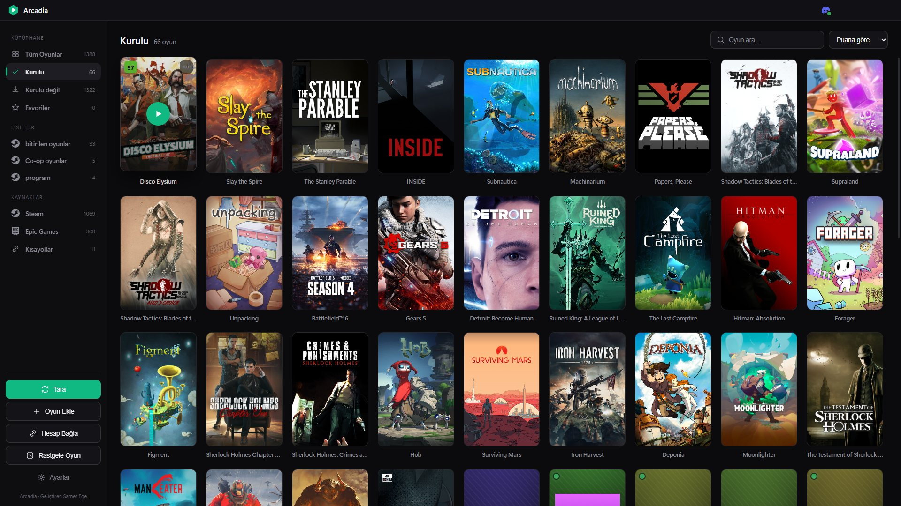
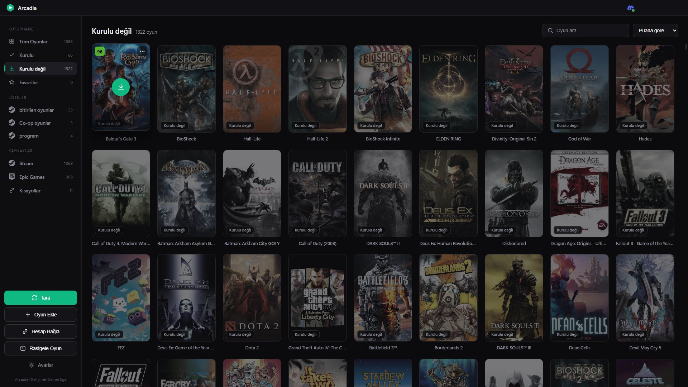
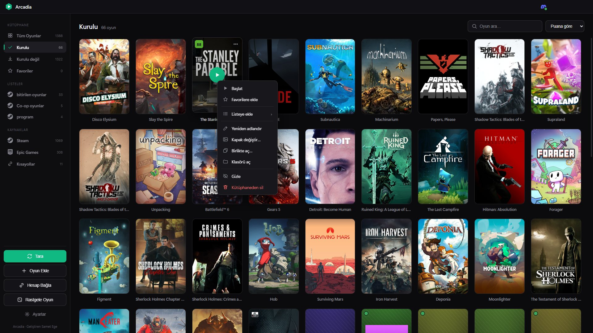
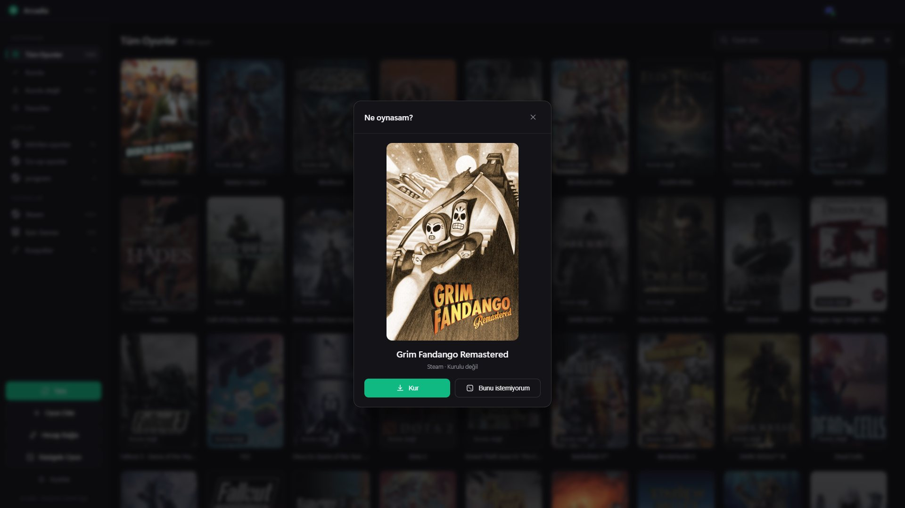
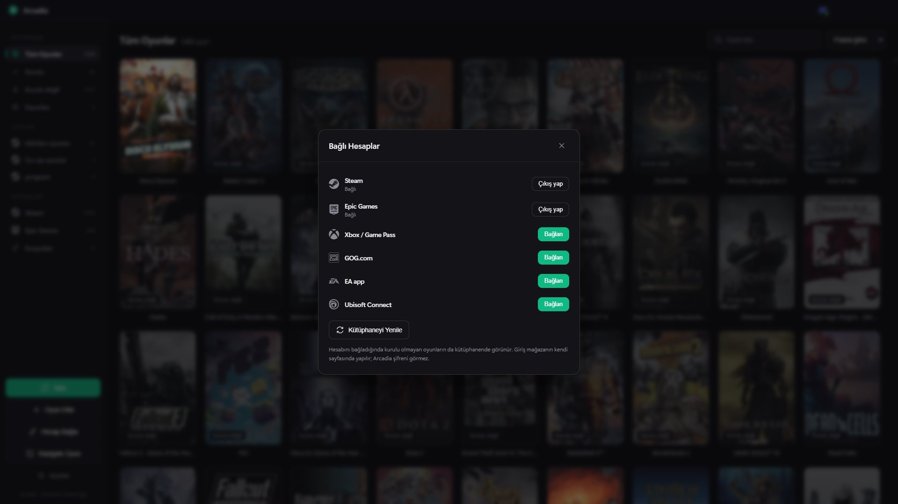

<div align="center">


# Arcadia

**Tüm oyunların tek bir şık kütüphanede.**

Arcadia bilgisayarındaki oyunları ve Steam, Epic Games, Xbox, GOG, EA ve Ubisoft Connect'te sahip olduklarını bulur,<br>
gerçek kapak görselleriyle gösterir; hepsini tek tıkla açar ya da kurar.

[](https://github.com/SametEge/Arcadia/releases/latest)
[](https://github.com/SametEge/Arcadia/releases)
[](https://github.com/SametEge/Arcadia/actions/workflows/ci.yml)


[](LICENSE)

### [⬇ Son sürümü indir](https://github.com/SametEge/Arcadia/releases/latest)

[English](README.md) · **Türkçe**



</div>

---

## İçindekiler

- [Öne çıkanlar](#-öne-çıkanlar)
- [Ekran görüntüleri](#-ekran-görüntüleri)
- [Kurulum](#-kurulum)
- [Başlarken](#-başlarken)
- [Kullanım](#-kullanım)
- [Desteklenen mağazalar](#-desteklenen-mağazalar)
- [Diller](#-diller)
- [Gizlilik ve verilerin](#-gizlilik-ve-verilerin)
- [SSS ve sorun giderme](#-sss-ve-sorun-giderme)
- [Kaynaktan derleme](#-kaynaktan-derleme)
- [Nasıl çalışır](#-nasıl-çalışır)
- [Proje yapısı](#-proje-yapısı)
- [Yol haritası](#-yol-haritası)
- [Katkıda bulunma](#-katkıda-bulunma)
- [Lisans](#-lisans)

## ✨ Öne çıkanlar

- **Bütün mağazalar tek kütüphanede** — Steam, Epic Games, Xbox / Game Pass, GOG, EA app, Ubisoft Connect, Riot ve masaüstü kısayolların hiçbir ayar yapmadan kendiliğinden bulunur.
- **Sadece kurulu olanlar değil, bütün koleksiyonun** — mağaza hesaplarını bağla; sahip olduğun ama kurmadığın oyunlar da gelir, kurulmaya hazır.
- **Arcadia'dan kur** — oyunu mağazanın kendi istemcisi indirir, Arcadia'nın indirme paneli de ilerlemeyi gösterir.
- **Gerçek kapaklar ve Metacritic puanları** — önce mağazanın kendi görseli, geri kalanlar için SteamGridDB, ya da senin seçtiğin herhangi bir resim.
- **Steam'le uyumlu listeler** — Steam koleksiyonların liste olarak gelir; tüm mağazalardan oyunlarla kendi listelerini de yapabilirsin.
- **Bir oyun, bir kart** — birden fazla mağazada görünen oyun iki kez gösterilmez.
- **Karar veremiyor musun?** — rastgele seçici senin yerine seçer.
- **Gizliliğine saygılı** — sunucu yok, telemetri yok, reklam yok. Her mağazanın kendi sayfasında giriş yaparsın; Arcadia şifreni asla görmez.
- **Altı dil**, sade koyu tasarım, sistem tepsisi ve otomatik güncellemeler.

## 📸 Ekran görüntüleri

<table>
  <tr>
    <td width="50%"><br><sub><b>Kurulu değil</b> — bağlı hesaplarındaki her şey, burada Metacritic puanına göre sıralı; kurulmalarına tek tık var.</sub></td>
    <td width="50%"><br><sub><b>Oyun menüsü</b> — favoriler, listeler, yeniden adlandırma, kapak değiştirme, birlikte açma, klasörü açma, gizleme.</sub></td>
  </tr>
  <tr>
    <td width="50%"><br><sub><b>Ne oynasam?</b> — kütüphanenden rastgele bir oyun; beğenmezsen yenisi.</sub></td>
    <td width="50%"><br><sub><b>Bağlı hesaplar</b> — Steam, Epic Games, Xbox / Game Pass, GOG, EA app ve Ubisoft Connect.</sub></td>
  </tr>
</table>

## 📥 Kurulum

### Gereksinimler

- **Windows 10** sürüm 1809 veya üzeri ya da **Windows 11** — 64 bit
- Yaklaşık **400 MB** boş disk alanı
- Kullandığın mağaza istemcileri (Steam, Epic Games Launcher, EA app, GOG Galaxy, Ubisoft Connect, Microsoft Store). Arcadia oyunları *onların üzerinden* açar ve kurar; yani bir oyunu oynamak için mağazasının kurulu olması gerekir.

### Kurulum dosyası

1. [Releases](https://github.com/SametEge/Arcadia/releases/latest) sayfasından en son **`Arcadia-Setup-<sürüm>.exe`** dosyasını indir.
2. Çalıştır. Windows önce uyarabilir — aşağıdaki iki nota bak.
3. Kurulacağı yeri seç. Arcadia yalnızca senin Windows hesabın için kurulur, yönetici izni gerekmez. Başlat menüsüne ve masaüstüne kısayol ekler, açılır ve oyunlarını tarar.

Release iş akışıyla hazırlanan sürümlerde bir `SHA256SUMS.txt` de bulunur; indirdiğin dosyayı kontrol edebilirsin:

```powershell
Get-FileHash .\Arcadia-Setup-<sürüm>.exe -Algorithm SHA256
```

<details>
<summary><b>⚠️ "Windows bilgisayarınızı korudu" (SmartScreen)</b></summary>

<br>

Bu uyarı **normal ve beklenen** bir şeydir — Arcadia'da bir sorun olduğu anlamına **gelmez**. Devam etmek için:

> **Ek bilgi → Yine de çalıştır**

Windows SmartScreen, **ücretli** bir kod imzalama sertifikasıyla imzalanmamış *her* kurulum dosyası için uyarır. Kod imzalamanın bir projenin açık kaynak olup olmamasıyla ilgisi yoktur; güvenilir birçok açık kaynak uygulama da aynı uyarıyı gösterir.

Arcadia tamamen açık kaynaktır; kurulum dosyasına körü körüne güvenmek zorunda değilsin: kodu okuyabilir, [kendin derleyebilirsin](#-kaynaktan-derleme). Sürümler etiketlenmiş kaynaktan doğrudan derlenir, normalde [GitHub Actions](.github/workflows/release.yml) ile.

</details>

<details>
<summary><b>🛡️ Akıllı Uygulama Denetimi kurulumu engelliyor</b></summary>

<br>

**Akıllı Uygulama Denetimi** (Smart App Control) açık olan Windows 11 bilgisayarlarda imzasız uygulamalar doğrudan engellenir — "Yine de çalıştır" düğmesi yoktur. Seçeneklerin:

- **Microsoft Store sürümünü bekle** (aşağıda). Store uygulamalarını Microsoft imzaladığı için Akıllı Uygulama Denetimi onlara izin verir.
- **Arcadia'yı kaynaktan çalıştır:** `npm start` ([Kaynaktan derleme](#-kaynaktan-derleme)). Electron'un kendi imzalı çalışma ortamını kullandığı için Akıllı Uygulama Denetimi buna izin verir.

Akıllı Uygulama Denetimi kapatılırsa Windows'u yeniden kurmadan tekrar açılamaz; sadece Arcadia için kapatma.

</details>

### Microsoft Store

Arcadia, **Arcadia Launcher** adıyla Microsoft Store'a geliyor. Store sürümünü Microsoft imzalar; SmartScreen ya da Akıllı Uygulama Denetimi uyarısı olmadan kurulur ve güncel tutma işini Store yapar. Yayına girince bağlantısı buraya eklenecek.

### Güncellemeler

Kurulu sürüm her açılışta GitHub'da yeni sürüm var mı diye bakar. **Ayarlar → Güncellemeler**'deki otomatik güncelleme açıksa (varsayılan olarak açık), yeni sürüm arka planda iner ve Arcadia'dan bir sonraki çıkışında kurulur. Kapatırsan önce sana sorulur: yeni sürüm hazır olduğunda **Ayarlar → Güncellemeler**'de **Yeniden başlat ve kur** düğmesi çıkar.

Microsoft Store sürümü bunu kullanmaz; onu Store günceller.

### Kaldırma

Arcadia'yı **Windows Ayarları → Uygulamalar**'dan kaldırabilirsin. Kütüphanen ve ayarların `%APPDATA%\Arcadia` klasöründe kalır; yeniden kurarsan kaldığın yerden devam edersin. Tamamen sıfırdan başlamak için kaldırdıktan sonra bu klasörü de sil.

## 🚀 Başlarken

1. **İlk açılış** — Arcadia bilgisayarını tarar (birkaç saniye sürer), Windows'la birlikte açılıp açılmayacağını sorar ve ana düğmeleri kısa bir turla tanıtır.
2. **Mağazalarını bağla** — kenar çubuğundaki **Hesap Bağla**'ya tıkla, bir mağaza seç ve mağazanın kendi sayfasında giriş yap. Sahip olup kurmadığın oyunlar **Kurulu değil** altında görünür.
3. **Oyna** — bir karta tıkla. Kurulu oyun mağazası üzerinden hemen açılır. Kurulu olmayan bir oyunda ise kurulumu mağazanın istemcisi başlatır, indirme paneli de (sağ üstte) takip eder.
4. **Düzenle** — favorilerini yıldızla, liste oluştur, Steam listelerini getirmek için **Steam listelerini göster**'i aç.
5. **Karar veremiyor musun?** — **Rastgele Oyun**'a tıkla. Beğenmedin mi? **Bunu istemiyorum** başka bir oyun seçer.

## 📖 Kullanım

### Kütüphane

Kenar çubuğu oyunlarını üç gruba ayırır:

| Grup | İçinde ne var |
|---|---|
| **Kütüphane** | **Tüm Oyunlar**, **Kurulu**, **Kurulu değil** ve **Favoriler**. Kurulu ve Kurulu değil, bağlı bir hesap bu bilgisayarda olmayan oyunlar ekleyince görünür. |
| **Listeler** | Kendi listelerin ve getirdiğin Steam koleksiyonları. Sürükleyerek sıralayabilirsin; yeniden adlandırmak ya da silmek için listeye sağ tıkla. |
| **Kaynaklar** | Her kaynak için bir görünüm: Steam, Epic Games, Xbox, GOG, EA, Ubisoft Connect, Kısayollar, Klasör ve Eklenenler. |

Üstteki kutuyla arama yapabilirsin — **/** tuşu doğrudan oraya götürür. **A → Z**, **Son eklenen**, **Son oynanan** ya da **Puana göre** sıralayabilirsin. Sıralama ne olursa olsun favoriler hep en başta durur.

### Oyun kartları

- Kartın **üstüne gelince** oynat düğmesi (kurulu olmayan oyunda kur düğmesi) ve Steam mağaza sayfası olan oyunlarda **Metacritic** puanı görünür. Puan Metacritic'in kendi renkleriyle gösterilir: yeşil iyi, sarı karışık, kırmızı zayıf.
- **Kurulu olmayan** oyunlar soluk görünür ve etiketlidir.
- **Çalışan** oyuna yeşil bir nokta konur; ortadaki düğmesi kırmızı bir **×**'e dönüşür ve oyunu — birlikte açtığın uygulamalarla beraber — kapatır.
- **⋯** düğmesi ya da sağ tık oyun menüsünü açar.

### Oyun menüsü

| Eylem | Ne yapar |
|---|---|
| **Başlat** | Oyunu açar. |
| **Favorilere ekle** | Oyunu her görünümün en başına sabitler. |
| **Listeye ekle ›** | Listelerinden birine ekler ya da oyunla birlikte **Yeni liste oluştur…** |
| **Yeniden adlandır** | Arcadia'da görünen adı değiştirir. Kutuyu boş bırakırsan asıl adına döner. |
| **Kapak değiştir…** | Bilgisayarındaki herhangi bir resmi kapak yapar. |
| **Birlikte aç…** | Bu oyunu her başlattığında açılacak uygulamaları seçer — Discord, FACEIT, overlay'ler… |
| **Klasörü aç** | Oyunun kurulu olduğu klasörü açar. |
| **Gizle** | Oyunu tüm görünümlerden gizler; yeniden taramalardan sonra da gizli kalır. |
| **Kütüphaneden sil** | Oyunu Arcadia'dan çıkarır. Arcadia'nın taramayla bulduğu bir oyun sonraki taramada geri gelir; hiç görmek istemediğin oyunlar için **Gizle**'yi kullan. |

### Mağaza hesaplarını bağlama

Kenar çubuğundaki **Hesap Bağla**'ya tıkla ya da **Ayarlar → Bağlı Hesaplar**'a git. Mağazanın kendi sayfasıyla bir giriş penceresi açılır. Şifreni oraya yazarsın, Arcadia'ya asla yazmazsın. Giriş yapınca pencere kapanır ve Arcadia kütüphaneni çeker.

| Mağaza | Nereye giriş yaparsın | Ne eklenir |
|---|---|---|
| **Steam** | Steam mağaza sitesi | hesabındaki bütün oyunlar — API anahtarı oluşturman gerekmez |
| **Epic Games** | Epic'in sitesi | Epic kütüphanen; DLC'ler ve müzik albümleri ayıklanır |
| **Xbox / Game Pass** | Microsoft hesabın | hesabındaki, PC'de oynanabilen Xbox oyunları |
| **GOG.com** | gog.com | GOG kütüphanen |
| **EA app** | EA'nın sitesi | EA'da sahip olduğun oyunlar; Steam'den aldıkların Steam oyunu olarak kalır |
| **Ubisoft Connect** | Ubisoft'un sitesi | en az bir kez oynadığın oyunlar¹ |

¹ Ubisoft, sahip olunan oyunların tam listesini yalnızca kendi başlatıcısına veriyor; Arcadia'nın kullandığı web API'si açtığın oyunları listeler.

Oturum bilgisayarında şifreli olarak saklanır, yani yalnızca bir kez giriş yaparsın. **Kütüphaneyi Yenile** kütüphanelerini yeniden çeker, **Çıkış yap** oturumu unutur. Bir mağaza oturumunu sonlandırırsa Arcadia seni yeniden bağlanman için uyarır.

### Oyun kurma

Sahip olup kurmadığın bir oyuna tıkladığında Arcadia mağazadan onu kurmasını ister:

| Mağaza | Ne açılır | Arcadia'daki ilerleme |
|---|---|---|
| **Steam** | Steam'in kurulum penceresi | yüzde, hız ve kalan süre |
| **Epic Games** | Epic Games Launcher | kurulum boyutu bilinince yüzde |
| **EA app** | EA app'teki indirme | oyun kurulunca bitti olarak görünür |
| **GOG** | GOG Galaxy'de oyunun sayfası | oyun kurulunca bitti olarak görünür |
| **Ubisoft Connect** | Ubisoft Connect; kurulumu oradan başlatırsın | oyun kurulunca bitti olarak görünür |
| **Xbox / Game Pass** | oyunun Microsoft Store sayfası | oyun kurulunca bitti olarak görünür |

**İndirme paneli** (sağ üstteki ↓ düğmesi) her kurulumu listeler: *Başlatılıyor*, *İndiriliyor*, *Kuruluyor* ve *Kuruldu*. Mağaza 90 saniye içinde başlamazsa kurulum *Başlatılamadı* olarak işaretlenir. Her kurulum **iptal** edilebilir. Hiçbir mağaza başka bir uygulamanın indirmesini durdurmasına izin vermez; bu yüzden İptal, kurulumu takip etmeyi bırakır ve indirme sürüyorsa mağazanın kendi indirme sayfasını açar, oradan durdurursun. **Mağazada aç** mağazanın istemcisine geçer, **Bitenleri temizle** listeyi toparlar. Kurulum bitince oyunun kartı kendiliğinden oynanabilir hâle gelir — yeniden taramaya gerek yok.

### Listeler ve Steam koleksiyonları

- **Liste oluştur:** bir oyuna sağ tıkla → **Listeye ekle** → **Yeni liste oluştur…**. Başka oyunları da aynı yoldan eklersin.
- **Yeniden adlandır, sil ya da sırala:** yeniden adlandırmak ya da silmek için kenar çubuğundaki listeye sağ tıkla; sırasını değiştirmek için listeleri yukarı aşağı sürükle.
- **Steam koleksiyonları:** **Ayarlar → Steam Listeleri → Steam listelerini göster**'i aç. Steam'i bağladığında Arcadia bunu kendisi de sorar. Koleksiyonlar Steam simgesiyle görünür; Steam'de değişen adlar ve oyunlar, listeler bir sonraki yenilendiğinde gelir.
- **Mağazaları karıştır:** herhangi bir listeye, Steam koleksiyonu da dahil, her mağazadan oyun ekleyebilirsin. Arcadia'da eklediklerin Arcadia'da kalır — Steam'e geri yazılan tek şey koleksiyon silmektir.
- **Bir Steam koleksiyonunu** Arcadia'da silmek onu Steam'de de siler. Bunun için Steam'in tamamen kapalı olması gerekir. Penceresini kapatınca Steam tepside çalışmaya devam eder; çalıştığı sürece silme bekler ve Steam kapanır kapanmaz uygulanır. **Ayarlar → Steam Listeleri → Steam'i kapat ve uygula** bunu hemen yapar. Arcadia bir şeyi değiştirmeden önce Steam'in koleksiyon dosyasının yedeğini `%APPDATA%\Arcadia\steam-collection-backups` içine alır.

### Bir oyun, birden çok mağaza

Aynı oyun birden fazla kütüphanende varsa Arcadia tek kart gösterir. Steam'den aldığın bir oyun, EA ya da Ubisoft Connect de listelese Steam oyunu olarak kalır; böylece nasıl aldıysan öyle açılır.

### Rastgele oyun

Kenar çubuğundaki **Rastgele Oyun**, kurulu olsun olmasın kütüphanenden bir oyun seçer. Hemen başlamak için **Şimdi oyna**'ya (ya da **Kur**'a), başka bir seçim için **Bunu istemiyorum**'a tıkla. Bütün kütüphaneni dolaşmadan aynı oyunu ikinci kez göstermez.

### Birlikte aç ve Discord

Oyun menüsündeki **Birlikte aç…** o oyuna uygulama bağlar — Discord, FACEIT, overlay'ler, kurulu herhangi bir şey. Bunlar oyunu başlatınca açılır, oyunu **×** ile kapatınca kapanır. Sağ üstteki Discord düğmesi Discord'u tek tıkla açar; Discord çalışırken yeşil yanar, × ile kapatılır.

### Kapak görselleri

Arcadia kapağı şu sırayla seçer; bir resim yüklenemezse bir sonrakine geçer:

1. **Kendi resmin** — **Kapak değiştir…** ile seçtiğin.
2. **Arcadia'yla gelen görseller** — Minecraft için elle çizilmiş kapaklar.
3. **Mağazanın kendi görseli** — Steam oyunlarında Steam kütüphanesinin kullandığı kapağın aynısı; bağlı Epic, GOG, EA ya da Xbox hesaplarından gelen oyunlarda o mağazanın verdiği görsel.
4. **SteamGridDB** — oyunun adıyla aranır.
5. Oyunun baş harfleriyle temiz bir **markalı kapak**.

Steam dışındaki oyunların kapakları, ortak bir SteamGridDB anahtarıyla kurulumdan itibaren çalışır. Bu anahtar bütün Arcadia kullanıcılarınca paylaşıldığı için istek sınırına takılabilir; kapakların hep sorunsuz gelmesi için kendi **ücretsiz** anahtarını ekle:

1. [steamgriddb.com](https://www.steamgriddb.com) → *Preferences → API* → anahtarını kopyala.
2. Arcadia → **Ayarlar → Kapak Görselleri (SteamGridDB)** → yapıştır, sonra **Şimdi Yeniden Tara**.

Anahtarın yalnızca senin bilgisayarında saklanır.

### Ayarlar

| Bölüm | Neler yapabilirsin |
|---|---|
| **Tarama Kaynakları** | Her kaynağı açıp kapat: Steam, Epic Games, Xbox, GOG, EA, Ubisoft Connect, Kısayollar ve Özel klasörler. |
| **Özel Oyun Klasörleri** | Klasör ekle; Arcadia içlerindeki oyunların `.exe` dosyalarını bulur. |
| **Bağlı Hesaplar** | Her mağazayı bağla, yenile ya da çıkış yap. |
| **Steam Listeleri** | Steam koleksiyonlarını göster, yenile; Steam'in kapanmasını bekleyen silmeleri uygula. |
| **Kapak Görselleri (SteamGridDB)** | Kendi SteamGridDB anahtarını kullan. |
| **Vurgu Rengi, Logo Rengi, Logo Şekli, Logo Simgesi** | Arcadia'yı kendine göre ayarla; Windows görev çubuğu simgesi logoyla birlikte anında değişir. |
| **Dil** | Altı dil arasında geçiş yap. |
| **Başlangıç** | Arcadia'yı Windows'la birlikte başlat. |
| **Güncellemeler** | Otomatik güncellemeyi aç/kapat, yeni sürüm var mı bak, inmiş sürümü kur. |
| **Hakkında** | Arcadia sürümün. |

**Şimdi Yeniden Tara** istediğin an tam tarama yapar. Microsoft Store sürümünde Başlangıç ve Güncellemeler işini Windows ve Store üstlenir.

### Sistem tepsisi

Pencereyi kapatınca Arcadia tepside çalışmaya devam eder; böylece başlattığın oyunların çalışıyor göstergesi sürer ve Arcadia anında açılır. En çok oynadığın oyunlar ve **Çıkış** için tepsi simgesine sağ tıkla.

### Klavye kısayolları

| Tuş | Ne yapar |
|---|---|
| **/** | Aramaya git |
| **Esc** | Menüleri ve panelleri kapat |

## 🎮 Desteklenen mağazalar

| Mağaza | Kurulu oyunlar | Hesap bağlama | Arcadia'dan kurma | İndirme ilerlemesi |
|---|:---:|:---:|:---:|---|
| **Steam** | ✅ | ✅ | ✅ | yüzde, hız, kalan süre |
| **Epic Games** | ✅ | ✅ | ✅ | boyut bilinince yüzde |
| **Xbox / Game Pass** | ✅ | ✅ PC oyunları | ✅ Microsoft Store üzerinden | bitince |
| **GOG** | ✅ | ✅ | ✅ GOG Galaxy üzerinden | bitince |
| **EA app** | ✅ | ✅ | ✅ | bitince |
| **Ubisoft Connect** | ✅ | ✅ en az bir kez oynanan oyunlar | ✅ | bitince |
| **Riot Games** | ✅ | — | — | — |
| **Kısayollar, klasörler, elle ekleme** | ✅ | — | — | — |

Hiçbir mağaza başka bir uygulamanın oyun indirmesine izin veren bir API sunmuyor; bu yüzden Arcadia kurulumu mağazanın kendi istemcisinden ister — Playnite'ın yaptığıyla aynı — ve ilerlemeyi oradan takip eder.

## 🌍 Diller

Arcadia altı dil konuşur ve Windows dilinden birini kendisi seçer; **Ayarlar → Dil**'den istediğin zaman değiştirebilirsin.

| Dil | | Dil | |
|---|---|---|---|
| 🇹🇷 Türkçe | Türkçe | 🇯🇵 日本語 | Japonca |
| 🇬🇧 English | İngilizce | 🇰🇷 한국어 | Korece |
| 🇩🇪 Deutsch | Almanca | 🇪🇸 Español | İspanyolca |

Otomatik seçim: Türkçe ve Azerbaycanca → Türkçe, Almanca → Almanca, Japonca → Japonca, Korece → Korece, İspanyolca → İspanyolca, geri kalan her şey → İngilizce.

## 🔒 Gizlilik ve verilerin

**Arcadia'nın bir sunucusu yok. Telemetri, analitik ya da reklam yok.** Bildiği her şey senin bilgisayarında kalır. Yalnızca şu servislerle konuşur:

| Servis | Neden |
|---|---|
| **Steam** | kurulu ve sahip olduğun oyunlar, kapak görselleri, Metacritic puanları (Steam'in mağaza verisinden) |
| **Epic Games, Microsoft / Xbox, GOG, EA, Ubisoft** | kütüphanen — yalnızca bağladığın hesaplar için |
| **SteamGridDB** | Steam'de olmayan oyunların kapakları |
| **GitHub** | güncelleme kontrolü (Microsoft Store sürümünde yok) |

Arcadia'nın kaydettiği her şey `%APPDATA%\Arcadia` klasöründedir:

| Dosya | İçinde ne var |
|---|---|
| `library.json` | kütüphanen, listelerin ve ayarların |
| `accounts.dat` | mağaza oturumları; Windows DPAPI ile şifreli, yalnızca senin Windows hesabın okuyabilir |
| `ratings.json`, `steam-assets.json`, `epic-catalog.json` | puanların ve mağaza görsellerinin önbelleği; tekrar tekrar indirilmesinler diye |
| `steam-collection-backups\` | bir silmeden önce alınan Steam koleksiyon dosyası kopyaları |

Politikanın tamamı [`PRIVACY.md`](PRIVACY.md) dosyasında.

## ❓ SSS ve sorun giderme

<details>
<summary><b>Kurulu bir oyunum görünmüyor</b></summary>

<br>

- **Ayarlar → Tarama Kaynakları**'nda kaynağının açık olduğundan emin ol, sonra **Şimdi Yeniden Tara**'ya tıkla.
- Arcadia'nın bakmadığı bir yere kuruluysa o klasörü **Ayarlar → Özel Oyun Klasörleri**'ne ekle.
- Ya da elle ekle: **Oyun Ekle** → oyunun `.exe`, `.lnk` ya da `.url` dosyasını seç.

</details>

<details>
<summary><b>Bir kapak eksik ya da yanlış</b></summary>

<br>

Oyuna sağ tıkla → **Kapak değiştir…** ile istediğin resmi kullan. Steam dışındaki oyunlarda daha iyi otomatik kapaklar için kendi ücretsiz SteamGridDB anahtarını ekle ([Kapak görselleri](#kapak-görselleri)) ve **Şimdi Yeniden Tara**'ya tıkla.

</details>

<details>
<summary><b>Bağladığım hesap bütün oyunlarımı göstermiyor</b></summary>

<br>

- **Ubisoft Connect** yalnızca en az bir kez oynadığın oyunları listeler.
- **Xbox**, hesabındaki PC'de oynanabilen oyunları listeler.
- **EA**, Steam'den aldığın oyunları göstermez — onlar kütüphanende Steam oyunu olarak durur.
- **Hesap Bağla**'da **Kütüphaneyi Yenile**'ye tıkla. Bir mağaza oturumunun sona erdiğini söylerse yeniden bağla.

</details>

<details>
<summary><b>Kur'a tıklayınca bir şey olmuyor ya da indirme "Başlatılamadı" diyor</b></summary>

<br>

Oyunun mağaza istemcisinin kurulu olması ve bağladığın hesapla giriş yapılmış olması gerekir. Mağazayı bir kez aç, giriş yap ve tekrar dene — ya da indirme panelindeki **Mağazada aç**'a tıkla.

</details>

<details>
<summary><b>Arcadia'da bir Steam listesini sildim ama Steam'de duruyor</b></summary>

<br>

Steam hâlâ çalışıyordu — penceresini kapatınca tepside çalışmaya devam eder ve değişikliğin üzerine yazar. Arcadia bekler ve Steam kapanır kapanmaz koleksiyonu siler. Hemen yapmak için **Ayarlar → Steam Listeleri → Steam'i kapat ve uygula**'yı kullan.

</details>

<details>
<summary><b>Arcadia oyunları kendisi mi indiriyor?</b></summary>

<br>

Hayır. Hiçbir mağaza başka bir uygulamanın kendi oyunlarını indirmesine izin vermez; bu yüzden Arcadia kurulumu mağazanın kendi istemcisine devreder — Playnite gibi — ve ilerlemeyi gösterir. Oyunların mağazanın kütüphanesinde kalır; güncellemeleri, bulut kayıtları ve DRM'iyle birlikte.

</details>

<details>
<summary><b>Verilerim nerede, Arcadia'yı nasıl sıfırlarım?</b></summary>

<br>

Her şey `%APPDATA%\Arcadia` klasöründe ([Gizlilik ve verilerin](#-gizlilik-ve-verilerin)). Sıfırdan başlamak için Arcadia'dan tepsiden çık ve bu klasörü sil; mağaza hesaplarını yeniden bağlaman gerekir.

</details>

## 🔧 Kaynaktan derleme

Gereksinimler: **Windows 10/11** ve [Node.js](https://nodejs.org) 18 veya üzeri. Testler Linux ve macOS'ta da çalışır.

```bash
git clone https://github.com/SametEge/Arcadia.git
cd Arcadia
npm install

npm start           # uygulamayı çalıştır
npm test            # ekransız testler
npm run test:login  # hesap giriş penceresi testi (gerçek pencereler açar)
npm run dist        # kurulum dosyasını dist/ içine derle
npm run dist:store  # Microsoft Store paketini derle (dist/Arcadia-<sürüm>-Store.appx)
npm run icon        # simgeleri ve Store karolarını assets/logo.svg'den yeniden üret (Python + Pillow)
```

### Testler

`npm test`, `build/` içindeki bütün ekransız test takımlarını çalıştırır; hiçbiri Electron'a ya da internete ihtiyaç duymaz:

| Takım | Neyi sınar |
|---|---|
| `test_i18n.js` | her arayüz metninin altı dilde de bulunması |
| `test_merge.js` | taranan ve sahip olunan oyunların birleştirilmesi, oyun başına tek kart |
| `test_downloads.js` | kurulum ilerlemesinin mağazaların kendi dosyalarından okunması |
| `test_epic_catalog.js` | toplu Epic katalog sorguları ve önbellekleri |
| `test_lists.js` | listeler ve Steam koleksiyonlarının aynalanması |
| `test_accounts.js` | GOG, EA ve Ubisoft tarayıcıları ve hesap kütüphaneleri, örnek kurulum kayıtları ve API yanıtlarıyla |
| `test_steam_delete.js` | Steam'in kendi dosya biçiminde yedekli koleksiyon silme |
| `test_covers.js` | Steam görsel adresleri ve kapak yedek sırası |

`npm run test:login` gerçek giriş pencereleri açtığı için Electron ister.

### Ekran görüntüleri

```bash
npx electron . --store-shots
```

Microsoft Store ekran görüntülerini — 1920×1080, her dil için bir takım — kendi kütüphanenden, ekranda görünmeyen bir pencerede `dist/store-screenshots/` içine üretir. `STORE_SHOT_LANGS=de,ja` yalnızca bazı dilleri çeker. Arcadia her profil için tek kopya çalıştırır; o yüzden Arcadia açıkken yardımcıyı `--user-data-dir=<klasör>` ile profilin bir kopyasına yönlendir. `docs/screenshots/` içindeki README görselleri bunların JPG kopyalarıdır.

### Sürüm yayınlama

Sürümleri [`release`](.github/workflows/release.yml) iş akışı çıkarır:

1. `package.json`'daki `version`'ı artır ve [`CHANGELOG.md`](CHANGELOG.md)'deki **Unreleased** notlarını yeni bir `## [x.y.z]` başlığının altına taşı.
2. Commit'le, sonra etiketleyip gönder: `git tag v1.1.0 && git push origin v1.1.0`.

İş akışı testleri çalıştırır, kurulum dosyasını derler ve kurulum dosyası, `latest.yml` (otomatik güncelleyicinin okuduğu dosya), blockmap ve `SHA256SUMS.txt` ile bir GitHub sürümü yayınlar. Sürüm notları `CHANGELOG.md`'deki ilgili bölümden gelir.

`npm run release` hâlâ kendi bilgisayarından derleyip yükler (bir `GH_TOKEN` ister), ama tercih edilen yol iş akışıdır.

`npm run dist` [`build/dist-win.js`](build/dist-win.js) üzerinden çalışır; böylece kurulum dosyası Akıllı Uygulama Denetimi açık bir bilgisayarda da derlenir: electron-builder kaldırıcıyı üretmek için normalde yeni derlenmiş bir yardımcı exe çalıştırır, Akıllı Uygulama Denetimi de bunu engeller; betik bu adımı hiçbir şey çalıştırmayan yola çevirir.

<details>
<summary><b>Microsoft Store paketi</b></summary>

<br>

Store paketi sertifikasyon sırasında Microsoft tarafından imzalanır; SmartScreen ya da Akıllı Uygulama Denetimi uyarısı olmadan kurulur — ücretli bir kod imzalama sertifikasının etkisi, bedavaya.

1. Store adı **Arcadia Launcher** (Store ID `9N22381XP9S9`); Partner Center kimliği `package.json`'daki `build.appx` içinde hazır. Oradaki `displayName` ayrılan adla birebir aynı kalmalı.
2. `npm run dist:store` bilgisayarda kurulu Windows SDK'yı kullanır (electron-builder'ın indirdiği araçlar ya Windows 11'de çalışmıyor ya da Akıllı Uygulama Denetimi'ne takılıyor). Karo görselleri `build/appx`'ten gelir, `npm run icon` yeniden üretir.
3. Her yüklemede `version` bir öncekinden büyük olmalı. Paket altı dilin hepsini bildirir ve her biri için bir Store sayfası gerekir.
4. `.appx`'i yükle. Altı dilin mağaza metinleri, `runFullTrust` gerekçesi ve sertifikasyon notları [`store/LISTING.md`](store/LISTING.md)'de; gizlilik politikası [`PRIVACY.md`](PRIVACY.md).

Store sürümünde Arcadia'nın kendi güncelleyicisi kapalıdır — Store uygulamalarını Store günceller — ve açılışta başlatma Windows'a bırakılır.

</details>

## 🧩 Nasıl çalışır

| Kaynak | Nasıl bulunur | Nasıl açılır |
|--------|---------------|--------------|
| **Steam** | `libraryfolders.vdf` + `appmanifest_*.acf` | `steam://rungameid/<appid>` |
| **Epic** | `ProgramData\Epic\…\Manifests\*.item` | `com.epicgames.launcher://` bağlantısı |
| **Xbox** | `XboxGames\<Oyun>\Content\` altındaki ana `.exe` | `.exe` |
| **GOG** | `HKLM\…\GOG.com\Games` | GOG Galaxy ya da `.exe` (GOG oyunları DRM'sizdir) |
| **EA app** | `ProgramData\EA Desktop` / `Origin` altındaki `.mfst` dosyaları | `origin2://` |
| **Ubisoft Connect** | `HKLM\…\Ubisoft\Launcher\Installs` | `uplay://launch/<id>` |
| **Riot** | `ProgramData\Riot Games\RiotClientInstalls.json` | Riot Client, `--launch-product` ile |
| **Kısayollar** | oyun istemcileri ve başlatıcıların masaüstü `.lnk` / `.exe` dosyaları | kısayolun kendisi |
| **Klasörler** | eklediğin klasörlerdeki `.exe` dosyaları | `.exe` |
| **Elle ekleme** | **Oyun Ekle** ile seçtiğin `.exe` / `.lnk` / `.url` | dosyanın kendisi |

Bağlı hesaplar bunun üstüne sahip olduklarını ekler:

| Hesap | Kütüphane nereden gelir |
|-------|-------------------------|
| **Steam** | `IPlayerService/GetOwnedGames`, mağaza sayfasının oturumuna verdiği token ile — API anahtarı gerekmez |
| **Epic** | başlatıcının OAuth kütüphane API'si; DLC'ler ve müzik albümleri ayıklanır |
| **Xbox** | `titlehub` oyun geçmişi, PC'de oynanabilen oyunlarla sınırlı |
| **GOG** | gog.com hesap kütüphanesi, gog.com oturumun üzerinden |
| **EA** | EA app'in kendi GraphQL servisi, EA oturumundan alınan kısa ömürlü token ile |
| **Ubisoft** | Ubisoft Connect web uygulamasının oynanan oyunlar listesi |

Kurulumlar her mağazanın kendi bağlantısıyla devredilir — `steam://install/<appid>`, `com.epicgames.launcher://apps/…?action=install`, `origin2://game/download?offerId=…`, `goggalaxy://openGameView/<id>`, `ms-windows-store://pdp/?PFN=…` ve Ubisoft Connect'i açan `uplay://` — ve mağazaların kendi dosyaları okunarak takip edilir: Steam'in `appmanifest_*.acf` dosyaları (indirilen ve yerleştirilen baytlar) ve Epic'in `.item` dosyaları. Diğer mağazalarda Arcadia oyunun kütüphanede belirmesini bekler.

Kütüphanen ve ayarların `%APPDATA%\Arcadia\library.json` içinde saklanır; mağaza oturumları ayrı olarak şifreli `accounts.dat` dosyasında durur ve asla `library.json`'a yazılmaz.

## 📁 Proje yapısı

```
Arcadia/
├── main.js                 # Electron ana süreci: pencere, IPC, tepsi, simge
├── preload.js              # Arayüz ile ana süreç arasındaki güvenli köprü
├── renderer/               # Arayüz (HTML / CSS / JS, kendi 6 dilli sözlüğüyle)
├── src/
│   ├── library.js          # Kütüphane ve ayar deposu (kurulu + sahip olunan birleştirme, listeler)
│   ├── launcher.js         # Oyun başlatma
│   ├── downloads.js        # Kurulum devri + ilerleme takibi
│   ├── updater.js          # GitHub sürümlerinden otomatik güncelleme
│   ├── ratings.js          # Metacritic puanları (önbellekli, arka planda çekilir)
│   ├── steamassets.js      # Steam kapak görselleri
│   ├── steamcollections.js # Steam koleksiyonları: okuma ve silme
│   ├── sgdb.js             # SteamGridDB kapak arama
│   ├── vdf.js              # Steam VDF/ACF ayrıştırıcı
│   ├── i18n.js             # Ana sürecin metinleri (iletişim kutuları, tepsi)
│   ├── accounts/           # steam, epic, xbox, gog, ea, ubisoft + şifreli token deposu
│   └── scanners/           # steam, epic, xbox, gog, ea, ubisoft, riot, kısayollar, klasörler
├── assets/                 # Logo ve simgeler (uygulamayla paketlenir)
├── build/
│   ├── appx/               # Microsoft Store karo görselleri
│   ├── make_icon.py        # Logodan uygulama simgesini üretir
│   ├── dist-store.js       # Microsoft Store paketi derlemesi
│   ├── store-shots.js      # Store / README ekran görüntüleri (electron . --store-shots)
│   └── test_*.js           # Ekransız testler (npm test)
├── docs/screenshots/       # README görselleri (İngilizce, Türkçesi tr/ içinde)
├── store/LISTING.md        # Altı dilde Microsoft Store sayfa metinleri
└── .github/                # CI, release iş akışı, issue ve PR şablonları
```

Yeni bir mağaza eklemek için `src/accounts/` içine `{ id, signIn, signOut, status, fetchLibrary }` dışa aktaran bir dosya yazıp `src/accounts/index.js`'e eklemek, bir de `src/scanners/` içine bir tarayıcı yazmak yeterli.

## 🧭 Yol haritası

- **Microsoft Store sürümü** — Arcadia Launcher adıyla
- **Emülatörler** — Switch emülatörleri ve DuckStation (PlayStation), emülatör + oyun klasörü profiliyle
- Battle.net ve Amazon Games gibi başka mağazalar

Fikirlerin varsa bir [özellik isteği](https://github.com/SametEge/Arcadia/issues/new/choose) aç.

## 🤝 Katkıda bulunma

Hata bildirimleri, fikirler ve pull request'ler memnuniyetle karşılanır — [`CONTRIBUTING.md`](CONTRIBUTING.md)'ye bak. Bir güvenlik açığı mı buldun? Lütfen [`SECURITY.md`](SECURITY.md)'de anlatıldığı gibi gizli olarak bildir.

## 📄 Lisans

[MIT](LICENSE) © 2026 Samet Ege

Arcadia; Valve, Epic Games, Microsoft, CD PROJEKT, Electronic Arts, Ubisoft, Riot Games ya da Metacritic ile bağlantılı değildir. Oyun adları, kapak görselleri ve mağaza logoları sahiplerine aittir.
